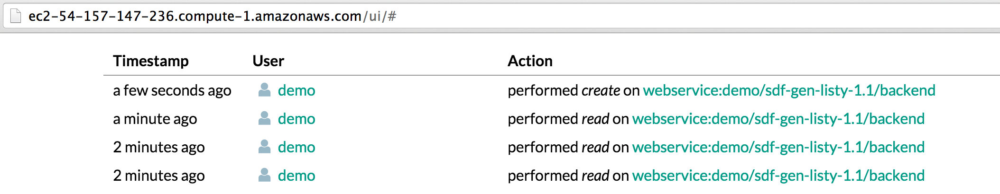
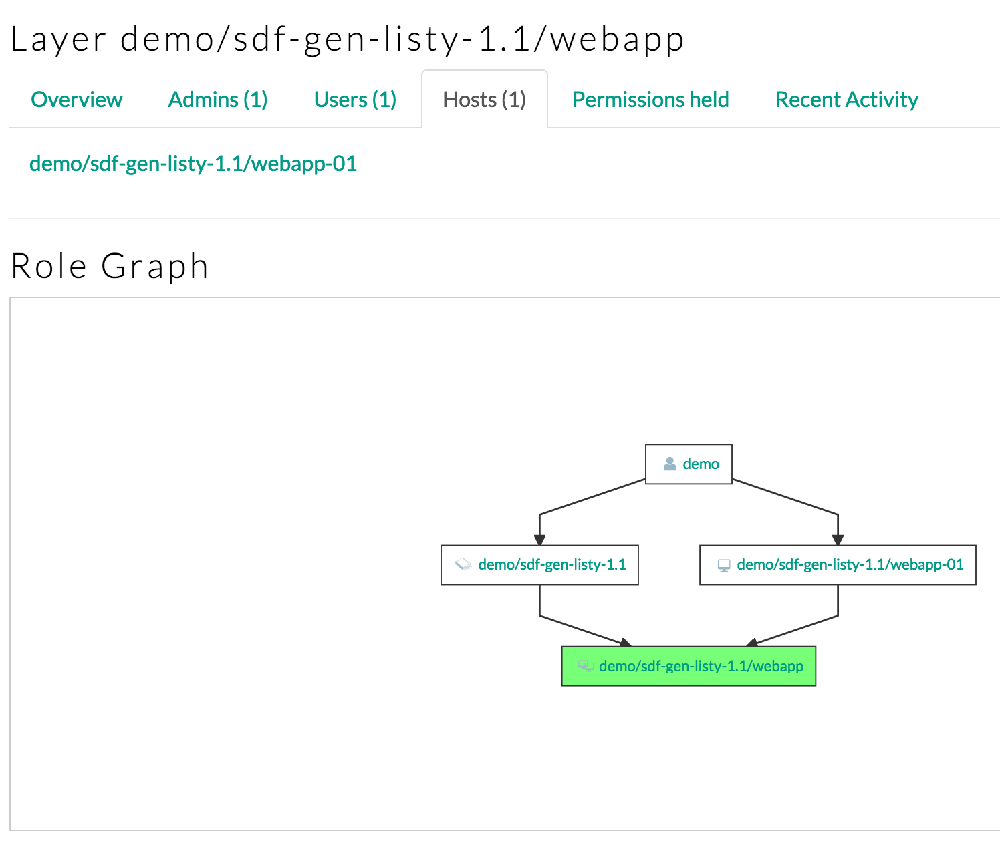
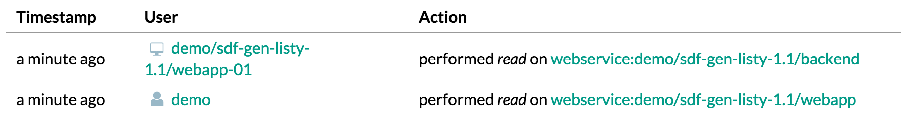

## Global Build

Store the project dir:

```
$ project_dir=$PWD
```

Load the policy file

```
$ conjur policy load -c policy-sandbox.json policy.rb
```

Build the project.

* Generate sdf.yml
* Process sdf.yml into nginx configs
* Build docker pods

```
./build.sh
```

## Run the backend

Start the backend containers as daemons:

```
$ cd $project_dir/backend
$ docker-compose up -d
```

## Setup your environment

If you're on Mac OS, the service hostname will be:

```
$ hostname=$(boot2docker ip)
```

Otherwise, it's localhost:

```
$ hostname=localhost
```

## Test the Backend

First, try and access the backend service directly with cURL:

```
$ curl http://$hostname:5000
```

Your request will be rejected, because it has no Authorization attached:

```html
<html>
	<head><title>403 Forbidden</title></head>
	<body bgcolor="white">
		<center><h1>403 Forbidden</h1></center>
		<hr><center>openresty/1.7.10.1</center>
	</body>
</html>
```

To authorize the request, we direct it through a local forwarder, which is provided by the Conjur CLI "proxy" plugin.

```
$ [sudo?] conjur plugin install proxy
```

Now test the backend through `conjur proxy`:

```
# Start the proxy
$ nohup conjur proxy -p 5000 http://$hostname:8085 2>&1 &
# Fetch the list
$ curl localhost:5000
{"list":[]}
# Append to the list
$ curl -X POST localhost:5000 --data name="alice"
# Fetch the list again
$ curl localhost:5000
{"list":["alice"]}
```

## Review the audit record

In the Conjur UI, you can see that Conjur is recording the `read` and `create` actions on the backend service:

<div style="border: 1px solid #cccccc">
	
</div>

# Setup the webapp

Create a host identity for the Forwarder. This host will belong to the `webapp` layer.

```
$ cd $project_dir
$ policy=$(cat policy-sandbox.json | jsonfield policy)
$ conjur host create $policy/webapp-01 | tee webapp-01.json
$ conjur layer hosts add $policy/webapp $policy/webapp-01
$ host_id=$(cat webapp-01.json | jsonfield id)
$ host_api_key=$(cat webapp-01.json | jsonfield api_key)
```

The UI shows that the new host belongs to the layer:

<div style="border: 1px solid #cccccc">
	
</div>

Now build the webapp pod:

```
$ cd $project_dir/webapp
$ docker-compose build
```

Build the identity container. The sole function of this container is to hold the host identity and provide it to the forwarder. We are doing it this way so that we don't have to put the host login and API key in plain text in the docker-compose.yml file.

```
$ docker build -t webapp_identity identity
```

Run the identity container:

```
$ docker run \
   -d \
   --name webapp_identity \
   -e CONJUR_AUTHN_LOGIN=host/$host_id \
   -e CONJUR_AUTHN_API_KEY=$host_api_key \
   webapp_identity
```

If you are using `boot2docker`, expose the backend port on the host:

```
$ VBoxManage controlvm boot2docker-vm natpf1 "expose-listy-backend,tcp,127.0.0.1,8085,,8085"
```

Now run the webapp:

```
$ docker-compose up -d
```

Start a `conjur proxy` to the webapp:

```
$ nohup conjur proxy -p 5001 http://$hostname:8080 2>&1 &
```

`curl` to the webapp:

```
$ curl localhost:5001
```

The application shows the list result:

```html
<!doctype html>
<html>
<head>
  <title>Hello, SDF</title>
</head>
  <body>
    <div class="list">
      <ul>
        
            <li>alice </li>
        
      </ul>
    </div>
    <div class="form">
      <form action="/" method="post">
        <label for="name">Add Item</label>
        <input type="text" name="name"/>
        <button type="submit">Add</button>
      </form>
    </div>
  </body>
</html>
```

Conjur audit records the access to the webapp by the demo user, and access to the backend by the webapp host:

<div style="border: 1px solid #cccccc">
	
</div>


# Test the Permission Model

In the above examples we have been logged in as the user who created
the whole permissions model.  Thus, we have been able to connect to 
both the web application and the web service.  

In [the permissions model](https://github.com/conjurinc/sdf-gen/blob/master/examples/listy/policy.rb), 
we have two groups: `users` and `admin`.  
Members of the `users` group are allowed to *view* items in our list, but
not *add* new items.  Members of the `admin` group are allowed to view *and*
add items.  Note that neither `users` nor `admin` members are allowed to connect
to the backend.  Only hosts in the `webapp` layer are allowed to do so.

Let's create some users in these groups and demonstrate this behavior.  Note
that we're using the `$policy` variable set above from the `policy-sandbox.json`
file.

```bash
# Create a user 'listy-user-1' and add her to the 'users' group
user_id="listy-user-1"
user_api_key=$(conjur user create $user_id | jsonfield api_key)
conjur group members add $policy/users $user_id
```

Now, we can log in as 'listy-user-1' and run `conjur proxy` to 
send our credentials with requests to the webapp.

```bash
conjur authn login -u $user_id -p $user_api_key
conjur proxy -p 5005 http://$hostname:8080
```

Open http://localhost:5005 in a browser, and notice that you can 
view the list of things.  However, if you try adding one, you'll
see nginx's "403 Forbidden" error page.  Kill the Conjur proxy with 
`ctrl-c` before continuing.

Next, let's promote `'listy-user-1'` to be a member of the `admin`
group.  Log back in as the Conjur user you used to create the permissions 
model, and add the test user to the `admin` group:

```bash
conjur group members add $policy/admin $user_id
```


And log in as the user and create a proxy:

```bash
conjur authn login -u $user_id -p $user_api_key
conjur proxy -p 5005 http://$hostname:8080
```

Now, when you open the webapp in a browser, you will be able to 
add items to the list.
